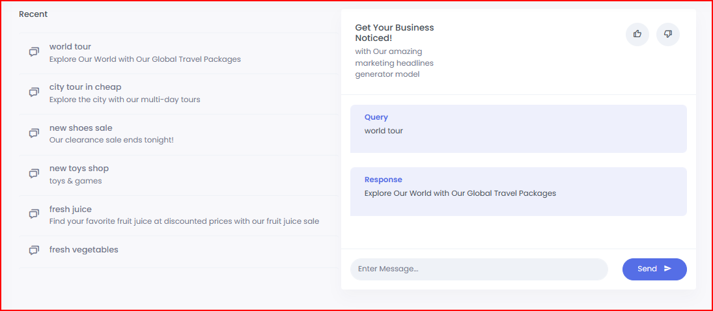

# Marketing Headline Generator [App Link](https://marketing-headline-generator.herokuapp.com/)
## Description:

- Tech Stack use `Node, Express, MongoDB, React, Redux`.
-  Fine-tune Chatgpt API and created a model: `davinci:ft-personal:marketing-headlines-model-2023-03-07-11-32-07`. This model gives engage marketing tagline to give your business a boost .
- Train model on `100 marketing headlines samples dataset`.
- User send a tagline and the model gives a 
- User sends a tagline and the model gives a attention-grabbing tagline to boost there business 


## Dataset
- model is fine-tuned on 100 marketing headlines samples.
```js
const dataset = [
    { prompt: "New Product Launch:", completion: "5 Tips for a Successful Launch" },
    { prompt: "Join Our Loyalty Program:", completion: "Get Exclusive Rewards and Discounts!" },
    { prompt: "Save on Your Next Purchase:", completion: "Shop Our Sale and Get Up to 50% Off!" },
    { prompt: "Discover the Latest Fashion Trends:", completion: "Shop Our New Collection Now" },
    { prompt: "Get More Done in Less Time:", completion: "Streamline Your Workflow with Our Productivity Tools" },
    { prompt: "The Perfect Gift for Any Occasion:", completion: "Surprise Your Loved Ones with Our Gift Cards" },
 ]
 ```
 
 ## Fine-tune Chatgpt model `davinci:ft-personal:marketing-headlines-model-2023-03-07-11-32-07`
.
```js
 const completion = await openai.createCompletion({
        model: "davinci:ft-personal:marketing-headlines-model-2023-03-07-11-32-07",
        prompt: promt,
        temperature: 0.7,
        max_tokens: 256,
        top_p: 1,
        frequency_penalty: 0,
        presence_penalty: 0,
        stop: ["END"],
    });
 ```


## Table of Contents 

- [Installation](#installation)
- [Usage](#usage)
- [Frontend](#Frontend)
- [Backend](#Backend)


## Installation

Start by installing all Node dependencies using `npm install` in root, then `cd client` to install the react dependencies using `yarn install`

## Usage

Run the Backend and frontend concurrently by using `npm run dev` or Run simple Backend by using `npm start`
or vist [https://marketing-headline-generator.herokuapp.com/](https://marketing-headline-generator.herokuapp.com/) and login with sample :

```js
email: test@gmail.com
password: 123456
 ```
   

## Frontend

The Frontend is Built using React and Redux.

- Responsive UI is designed using the CSS framework Bootstrap.


- Redux is a predictable state container for JavaScript apps.

It helps you write applications that behave consistently, run in different environments (client, server, and native), and are easy to test. On top of that, it provides a great developer experience.

Building Parts of redux:
 
- Store
- Reducer
- Action


## Backend

Backend is set up on Node and Express server.

Express is a minimal and flexible Node.js web application framework that provides a robust set of features to develop web and mobile applications. It facilitates the rapid development of Node based Web applications.

Allows to Define a routing table which is used to perform different actions based on HTTP Method and URL.


Backend Server run on the `http://localhost:5000`

we can access the user API in Postman by `http://localhost:5000/api/interactions/postInteraction`

## Output



